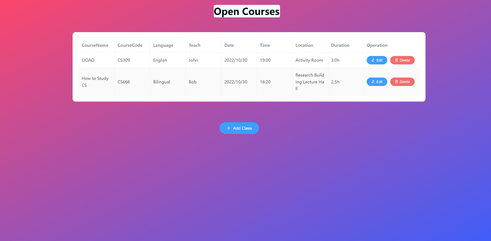
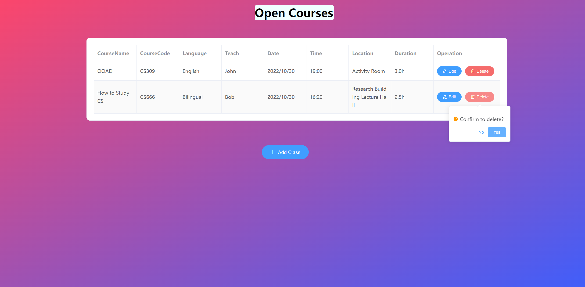
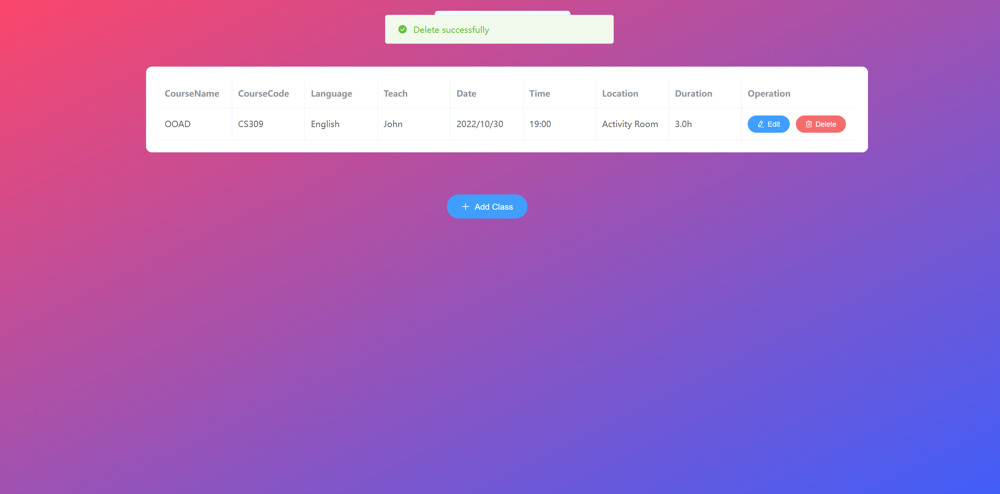
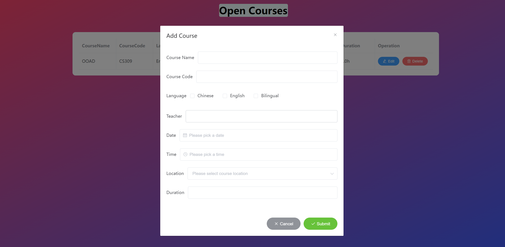
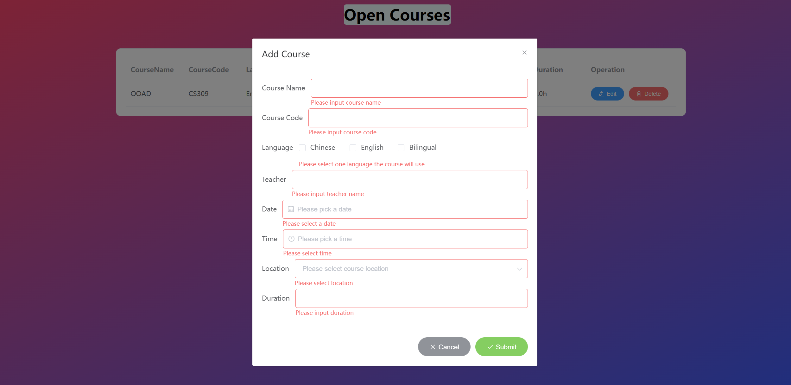
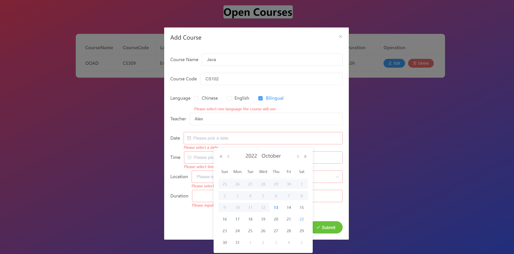
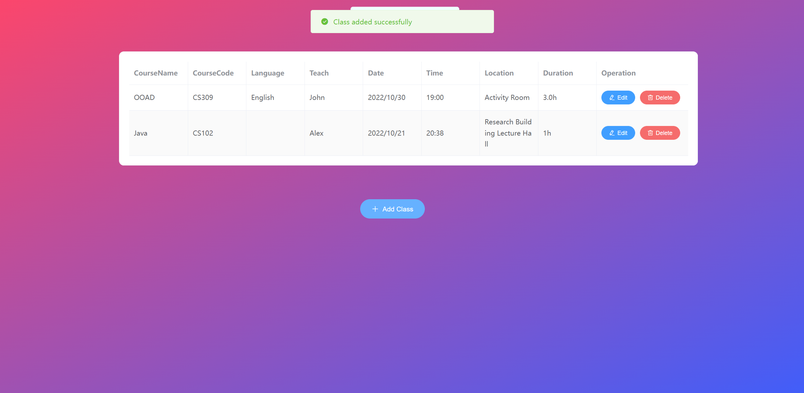
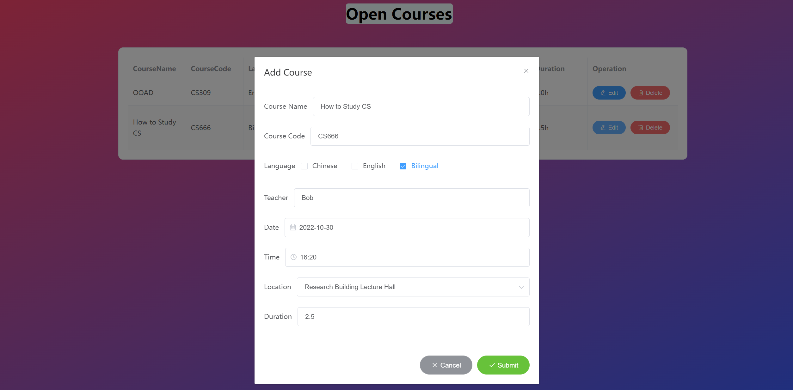
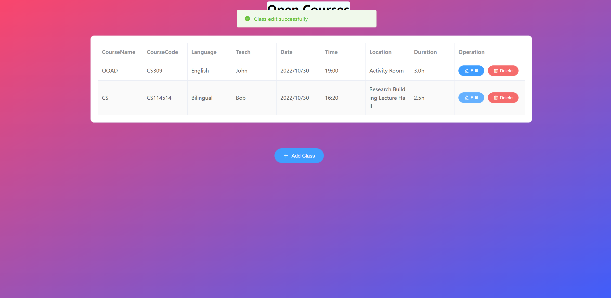

# cs309-ooad

## Project setup
```
npm install
```

### Compiles and hot-reloads for development
```
npm run serve
```

### Compiles and minifies for production
```
npm run build
```


# Page Screenshots

## Main Page



## Delete Row





# Add new course

- Pop out dialog

  

- Form validation

  

  

- Add successfully

  

## Edit row




